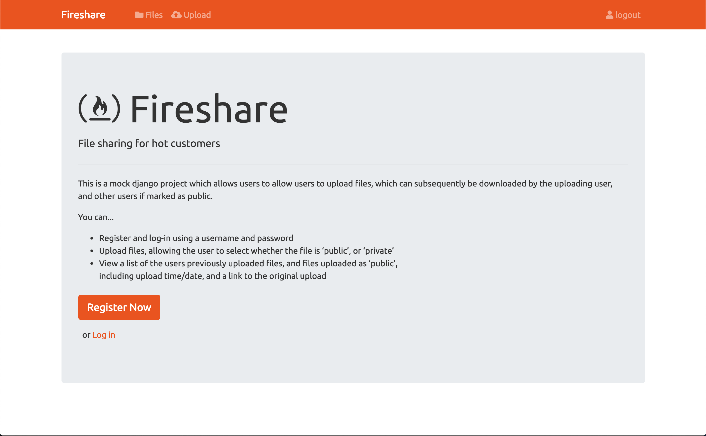

# PSP File Upload App - 'Fireshare'

This is a mock django project which allows users to allow users to upload files, which can subsequently be downloaded by the uploading user, and other users if marked as public.



## Setup

```bash
pip install -r requirements.txt
```

```bash
python manage.py migrate
```

```bash
python manage.py runserver
```
